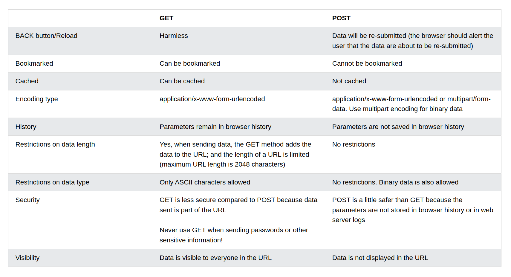

<!--
 * @Author: Ada J
 * @Date: 2022-08-26 10:25:02
 * @LastEditTime: 2022-08-27 16:35:01
 * @Description: 
-->
# 网络协议
## HTTP概念
**超文本传输协议（HTTP)** 是一个用于传输超媒体文档（例如 HTML）的应用层协议。基于 TCP/IP 层。HTTP 是无状态协议。
[点击查看MDN](https://developer.mozilla.org/zh-CN/docs/Web/HTTP)
## HTTP 请求的方式
* **GET** 方法请求一个指定资源的表示形式，使用 GET 的请求应该只被用于获取数据。

* **POST** 方法用于将实体提交到指定的资源，通常导致在服务器上的状态变化或副作用。

* HEAD 方法请求一个与 GET 请求的响应相同的响应，但没有响应体。

* PUT 方法用请求有效载荷替换目标资源的所有当前表示。

* DELETE 方法删除指定的资源。

* CONNECT 方法建立一个到由目标资源标识的服务器的隧道。

* OPTIONS 方法用于描述目标资源的通信选项。

* TRACE 方法沿着到目标资源的路径执行一个消息环回测试。

* PATCH 方法用于对资源应用部分修改。

## GET 和 POST 的区别

## HTTP 常用状态码
* 信息响应 (100–199)
* 成功响应 (200–299)
* 重定向消息 (300–399)
* 客户端错误响应 (400–499)
* 服务端错误响应 (500–599)

[点击查看MDN](https://developer.mozilla.org/zh-CN/docs/Web/HTTP/Status)

## HTTP 常用请求头
**HTTP 消息头**允许客户端和服务器通过 request和 response传递附加信息。

* 根据不同上下文，可将消息头分为：
  * General headers: 同时适用于请求和响应消息，但与最终消息主体中传输的数据无关的消息头。
  * Request headers: 包含更多有关要获取的资源或客户端本身信息的消息头。
  * Response headers: 包含有关响应的补充信息，如其位置或服务器本身（名称和版本等）的消息头。
  * Entity headers: 包含有关实体主体的更多信息，比如主体长 (Content-Length) 度或其 MIME 类型。

[点击查看MDN](https://developer.mozilla.org/zh-CN/docs/Web/HTTP/Headers)
## HTTP 和 HTTPS*
## HTTP2.0*
## TCP 和 UDP*
## WebSocket 的实现和应用*
