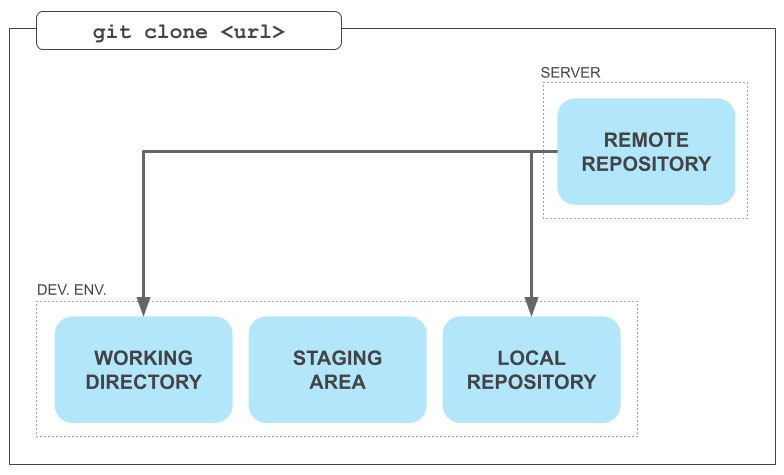
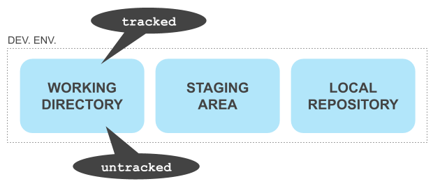
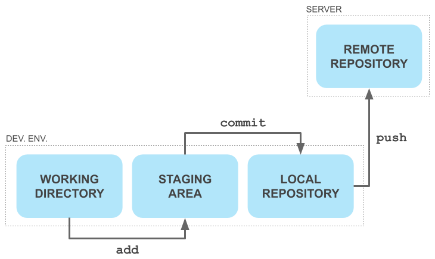
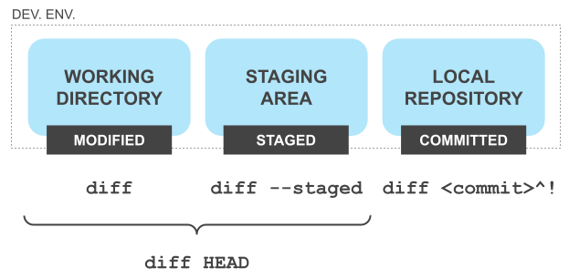
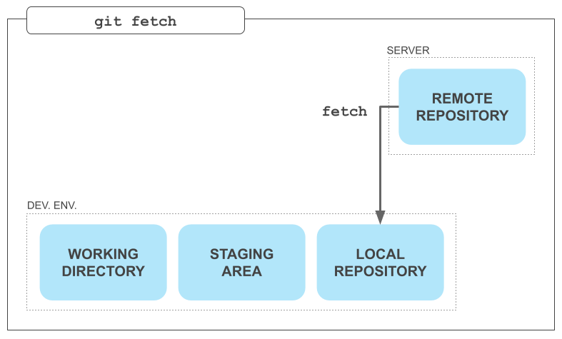
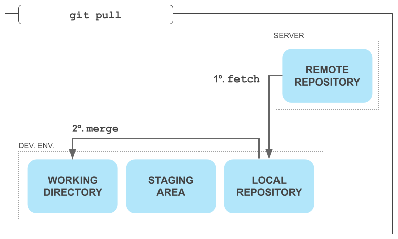
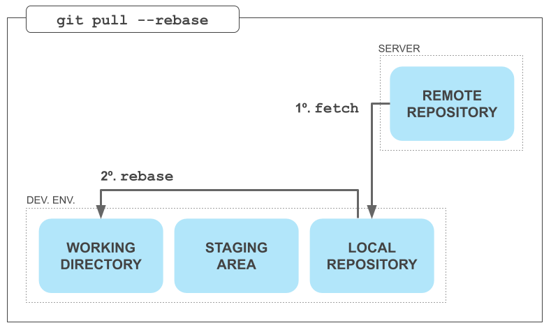

<!--
 * @Author: your name
 * @Date: 2021-07-14 10:54:12
 * @LastEditTime: 2022-08-27 16:06:51
 * @LastEditors: Please set LastEditors
 * @Description: In User Settings Edit
 * @FilePath: /my-training-doc/docs/git/index.md
-->
# GIT使用

## Git是什么
Git 是一个开源的分布式版本控制系统，用于敏捷高效地处理任何或小或大的项目。

## Git如何工作
### Clone a repo
* git clone `<url>`

### Making changes in the working directory

### Updating the remote repository
* git add/ git commit/ git push

* git diff

### Updating the development environment
  * **Fetching**
    * git fetch
    
  * **Pulling**
    * git pull
    
    * git pull --rebase
    
## 解决冲突
## 视图化工具
