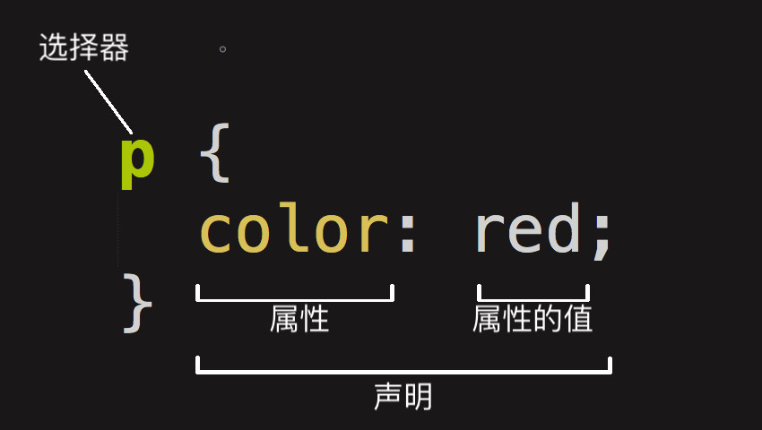

<!--
 * @Author: your name
 * @Date: 2021-07-14 09:48:26
 * @LastEditTime: 2022-08-26 10:05:30
 * @LastEditors: Please set LastEditors
 * @Description: In User Settings Edit
 * @FilePath: /my-training-doc/docs/html-css/css.md
-->
# CSS

## 常用CSS属性和值
color: red;  
font-size: 14px;  
...  
这个结构称为**规则集**（通常简称“规则”）  

## 块元素，行元素
## 选择器
CSS选择器是CSS规则的第一部分。它是元素和其他部分组合起来告诉浏览器哪个HTML元素应当是被选为应用规则中的CSS属性值的方式。选择器所选择的元素，叫做“选择器的对象”。

::: tip 选择器种类
1. 类型选择器  
2. 类选择器  
3. ID选择器  
4. ...[点击查看MDN](https://developer.mozilla.org/zh-CN/docs/Learn/CSS/Building_blocks/Selectors)
:::

## 盒模型
盒模型定义了盒的每个部分 —— margin, border, padding, and content —— 合在一起就可以创建我们在页面上看到的内容。为了增加一些额外的复杂性，有一个**标准**的和 **替代（IE）** 的盒模型。
::: tip CSS中组成一个块级盒子需要:
**Content box**: 这个区域是用来显示内容，大小可以通过设置 width 和 height.  
**Padding box**: 包围在内容区域外部的空白区域； 大小通过 padding 相关属性设置。  
**Border box**: 边框盒包裹内容和内边距。大小通过 border 相关属性设置。  
**Margin box**: 这是最外面的区域，是盒子和其他元素之间的空白区域。大小通过 margin 相关属性设置。  
:::
**标准盒模型**  
在标准模型中，如果你给盒设置 width 和 height，实际设置的是 content box。 padding 和 border 再加上设置的宽高一起决定整个盒子的大小。  
::: warning 等同于
盒子宽高width / height = content（设置的宽高） + padding + border  
:::
**IE盒模型**  
你给盒设置 width 和 height，就是盒子实际的宽高。  
::: warning 等同于
content宽高 = width / height（设置的宽高） - padding - border
:::

***默认浏览器会使用标准模型（box-sizing: content-box）。如果需要使用IE盒模型，可以通过为其设置 box-sizing: border-box 来实现。***
## 正常布局流
正常布局流(normal flow)是指在不对页面进行任何布局控制时，浏览器默认的HTML布局方式。（和汉字的书写模式相同，从上到下，从左到右）
## 弹性盒子布局
Flexbox是CSS弹性盒子布局模块（Flexible Box Layout Module）的缩写，它被专门设计出来用于创建横向或是纵向的一维页面布局。我们需要给这些flexible元素的父元素display设置一个特定值（flex）。  
flex模型说明如下:[点击查看MDN](https://developer.mozilla.org/zh-CN/docs/Learn/CSS/CSS_layout/Flexbox)  
 
## 定位、浮动
**定位**:举个栗子，网站上的“回顶”按钮，无论页面如何滚动，它始终处在相对于浏览器视口的固定位置。*position*的属性值以及定位上下文。[点击查看MDN](https://developer.mozilla.org/zh-CN/docs/Learn/CSS/CSS_layout/Positioning) 

**浮动**:举个栗子，在图像周围浮动一个文本块。*float*的属性值以及清除浮动。[点击查看MDN](https://developer.mozilla.org/zh-CN/docs/Learn/CSS/CSS_layout/Floats)
## CSS3新属性
**CSS3 边框**: border-radius、box-shadow、border-image...  
**CSS3 背景**: background-size、background-origin...  
**CSS3 文字效果**: word-break、text-overflow...  
...
## 过渡、动画*
**CSS3 转换**: transform、transform-origin...  
**CSS3 过渡**: transition、transition-duration...  
**CSS3 动画**: @keyframes、animation...  
...
## 重绘和回流*
## CSS预处理器*
## CSS书写与命名*
包括命名规范以及书写规范，[可借鉴一些比较好的规范示例](https://www.bookstack.cn/read/html-css-guide/css)

