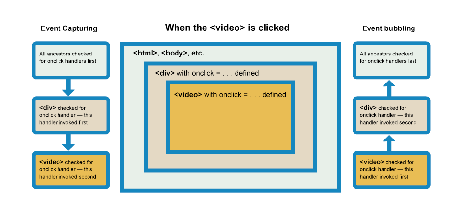

<!--
 * @Author: your name
 * @Date: 2021-07-14 09:48:07
 * @LastEditTime: 2022-08-27 17:11:28
 * @LastEditors: Please set LastEditors
 * @Description: In User Settings Edit
 * @FilePath: /my-training-doc/docs/html-css/html.md
-->
# JAVASCRIPT

## 语法、数据类型
### 基本语法
基础语法和注释
### 变量
**变量的声明**  
::: tip JavaScript有三种声明方式：
**var**  
声明一个变量，可选初始化一个值。  
**let**(ES6)  
声明一个块作用域的局部变量，可选初始化一个值。  
**const**(ES6)  
声明一个块作用域的只读常量。  
:::

**变量的作用域**  
在函数之外声明的变量，叫做*全局变量*，因为它可被当前文档中的任何其他代码所访问。在函数内部声明的变量，叫做*局部变量*，因为它只能在当前函数的内部访问。  

*ES6之前的JavaScript没有语句块作用域；相反，语句块中声明的变量将成为语句块所在函数（或全局作用域）的局部变量。*

```javascript
if (true) {
  var x = 5;
}
console.log(x); // 5
```
```javascript
if (true) {
  let y = 5;
}
console.log(y); // ReferenceError: y 没有被声明
```

**变量提升**  
JavaScript变量的另一个不同寻常的地方是，你可以先使用变量稍后再声明变量而不会引发异常。这一概念称为*变量提升*；

```javascript
/**
 * 例子1
 */
console.log(x === undefined); // true
var x = 3;

/**
 * 例子2
 */
// will return a value of undefined
var myvar = "my value";
(function() {
  console.log(myvar); // undefined
  var myvar = "local value";
})();

```
**函数提升**  
对于函数来说，只有*函数声明*会被提升到顶部，而*函数表达式*不会被提升。

```javascript
/* 函数声明 */
foo(); // "bar"
function foo() {
  console.log("bar");
}

/* 函数表达式 */
baz(); // 类型错误：baz 不是一个函数
var baz = function() {
  console.log("bar2");
};
```
### 数据类型
最新的 ECMAScript 标准定义了8种数据类型：
::: tip 数据类型
**七种基本数据类型**: 布尔值（Boolean）、null、undefined、数字（Number）、字符串（String）、任意精度的整数 (BigInt)、代表（Symbol）  

**对象**（Object）
:::
### 字面量
字面量是由语法表达式定义的常量；或，通过由一定字词组成的语词表达式定义的常量
::: tip 例如： 数组字面量
var coffees = ["French Roast", "Colombian", "Kona"];
:::
## 流程控制与循环迭代
**流程控制**  
::: tip 
**条件判断语句**  
if...else  
switch  
**异常处理语句**  
try/catch/throw  
Error 对象
:::

**循环迭代**
::: tip 语句
for  
while  
do...while  
break/continue  
for..in  
for..of  
:::
## 表达式和运算符
包括了赋值，比较，算数，位运算，逻辑，字符串，三元等等。
## 函数
### 定义函数
**函数声明**  
```javascript
function square(number) {
  return number * number;
}
```
**函数表达式**  
```javascript
const square = function(number) { return number * number; };
var x = square(4); // x gets the value 16
```
### 调用函数
定义一个函数并不会自动的执行它。调用函数才会以给定的参数真正执行这些动作。

### 函数作用域
在函数内定义的变量不能在函数之外的任何地方访问，因为变量仅仅在该函数的域的内部有定义。相对应的，一个函数可以访问定义在其范围内的任何变量和函数。换言之，定义在全局域中的函数可以访问所有定义在全局域中的变量。在另一个函数中定义的函数也可以访问在其父函数中定义的所有变量和父函数有权访问的任何其他变量。

### 闭包
```javascript
function outside(x) {
  function inside(y) {
    return x + y;
  }
  return inside;
}
fn_inside = outside(3); // 可以这样想：给一个函数，使它的值加3
result = fn_inside(5); // returns 8

result1 = outside(3)(5); // returns 8
```
*注意：由于闭包会使得函数中的变量都被保存在内存中，内存消耗很大，所以不能滥用闭包，否则会造成网页的性能问题，在IE中可能导致内存泄露。解决方法是，在退出函数之前，将不使用的局部变量全部删除。*

## 标准内置对象
主要指的是在程序执行前存在全局作用域里的由javascript定义的一些全局值属性、函数和用来实例化其他对象的构造函数对象。一般我们经常用到的如全局变量值NaN、undefined，全局函数如parseInt()、parseFloat()，用来实例化对象的构造函数如Date、Object等，还有提供数学计算的单体内置对象如 Math对象。[点击查看MDN](https://developer.mozilla.org/zh-CN/docs/Web/JavaScript/Reference/Global_Objects)

## 事件
事件是编程时系统内发生的动作或者发生的事情，系统响应事件后，如果需要，您可以某种方式对事件做出回应。例如：如果用户在网页上单击一个按钮，您可能想通过显示一个信息框来响应这个动作。

### 事件处理程序
**行内事件处理器/  HTML事件处理程序** - (不建议)
```html
<button onclick="alert('Hello, this is my old-fashioned event handler!');">Press me</button>
```
**事件处理器属性/ DOM0级事件处理程序**  
```javascript
const btn = document.querySelector('button');

btn.onclick = function() {
  const rndCol = 'rgb(' + random(255) + ',' + random(255) + ',' + random(255) + ')';
  document.body.style.backgroundColor = rndCol;
}
```
**addEventListener 和removeEventListener/ DOM2级事件处理程序**  
```javascript
const btn = document.querySelector('button');

function bgChange() {
  const rndCol = 'rgb(' + random(255) + ',' + random(255) + ',' + random(255) + ')';
  document.body.style.backgroundColor = rndCol;
}

btn.addEventListener('click', bgChange);
```
### 其他事件概念
**事件对象**  
有时候在事件处理函数内部，您可能会看到一个固定指定名称的参数，例如event，evt或简单的e。 这被称为事件对象，它被自动传递给事件处理函数，以提供额外的功能和信息。
```javascript
function bgChange(e) {
  const rndCol = 'rgb(' + random(255) + ',' + random(255) + ',' + random(255) + ')';
  e.target.style.backgroundColor = rndCol;
  console.log(e);
}

btn.addEventListener('click', bgChange);
```
**阻止默认行为**  
```javascript
form.onsubmit = function(e) {
  if (fname.value === '' || lname.value === '') {
    e.preventDefault();
    para.textContent = 'You need to fill in both names!';
  }
}
```
**事件流 - 事件冒泡及捕获**  


**事件委托**

冒泡还允许我们利用事件委托——这个概念依赖于这样一个事实，如果你想要在大量子元素中单击任何一个都可以运行一段代码，您可以将事件监听器设置在其父节点上，并让子节点上发生的事件冒泡到父节点上，而不是每个子节点单独设置事件监听器。

## DOM、BOM操作
### DOM相关
我们在编写HTML代码并且运行后，就会在内存中得到一棵DOM树，HTML的写法会被转化成对应的文档模型，而我们则可以通过JavaScript等语言去访问这个文档模型（DOM）。这里我们每天都需要用到，要重点掌握的是：***Document***、***Element***、***Text*** 节点。  

**Node**  
Node是DOM树继承关系的根节点，它**定义了DOM节点在DOM树上的操作**，首先，Node提供了一组属性，来表示它在DOM树中的关系，它们是：  
* parentNode  
* childNodes  
* firstChild  
* lastChild  
* nextSibling  
* previousSibling  

从命名上，我们可以很清晰地看出，这一组属性提供了前、后、父、子关系，有了这几个属性，我们可以很方便地根据相对位置获取元素。当然，Node中也提供了操作DOM树的API，主要有下面几种：  
* appendChild  
* insertBefore  
* removeChild  
* replaceChild  

**Element 与 Attribute**  
**Node提供了树形结构上节点相关的操作**。而大部分时候，我们比较关注的是元素。Element表示元素，它是Node的子类。元素对应了HTML中的标签，它既有子节点，又有属性。所以Element子类中，有一系列操作属性的方法。  

首先，我们可以把元素的**Attribute当作字符串**来看待，这样就有以下的 API：  
* getAttribute  
* setAttribute  
* removeAttribute  
* hasAttribute  

如果你追求极致的性能，还可以把**Attribute当作节点**：  
* getAttributeNode  
* setAttributeNode  
此外，如果你喜欢property一样的访问attribute，还可以**使用attributes对象**，比如 document.body.attributes.class = “a” 等效于 document.body.setAttribute(“class”, “a”)。  

**查找元素**  
document节点提供了查找元素的能力。比如有下面的几种。  
* querySelector  
* querySelectorAll  
* getElementById  
* getElementsByName  
* getElementsByTagName  
* getElementsByClassName  


### BOM相关
javaScript是通过访问BOM（Browser Object Model 浏览器对象模型）对象来访问、控制、修改客户端(浏览器)，由于BOM的window包含了document，因此可以直接使用window对象的document属性，通过document属性就可以访问、检索、修改文档内容与结构。  

BOM操作就是操作浏览器相关的api，**window**是BOM中的顶层对象：  
* window对象
* history对象
* document对象
* location对象
* navigator对象
* screen对象

## 正则表达式
[正则表达式的创建和使用](https://developer.mozilla.org/zh-CN/docs/Web/JavaScript/Guide/Regular_Expressions)
## XMLHttpRequest
**XMLHttpRequest**（XHR）对象用于与服务器交互。通过 XMLHttpRequest 可以在不刷新页面的情况下请求特定 URL，获取数据。这允许网页在不影响用户操作的情况下，更新页面的局部内容。XMLHttpRequest 在 AJAX 编程中被大量使用。  
```js
function reqListener () {
  console.log("readyState", this.readyState)
  console.log("responseText", this.responseText);
}
var oReq = new XMLHttpRequest();
oReq.onreadystatechange = reqListener;
oReq.open("GET", "https://developer.mozilla.org/");
oReq.send();
```
### AJAX
**MDN定义**  
AJAX（Asynchronous JavaScript And XML ）是一种使用 XMLHttpRequest 技术构建更复杂，动态的网页的编程实践。

**特点**  
AJAX允许只更新一个 HTML 页面的部分 DOM，而无须重新加载整个页面。——**局部刷新**  
AJAX还允许异步工作，这意味着当网页的一部分正试图重新加载时，您的代码可以继续运行。——**异步**
## this<font color=#3eaf7c>*</font>
[点击查看MDN](https://developer.mozilla.org/zh-CN/docs/Web/JavaScript/Reference/Operators/this)  
**全局上下文**  
无论是否在严格模式下，在全局执行环境中（在任何函数体外部）this 都指向全局对象。  
```javascript
// 在浏览器中, window 对象同时也是全局对象：
console.log(this === window); // true

a = 37;
console.log(window.a); // 37

this.b = "MDN";
console.log(window.b)  // "MDN"
console.log(b)         // "MDN"
```
**函数上下文**  
在函数内部，this的值取决于函数被调用的方式。  

因为下面的代码不在严格模式下，且 this 的值不是由该调用设置的，所以 this 的值默认指向全局对象，浏览器中就是 window。
```javascript
function f1(){
  return this;
}
//在浏览器中：
f1() === window;   //在浏览器中，全局对象是window

//在Node中：
f1() === globalThis;
```
然而，在严格模式下，如果进入执行环境时没有设置 this 的值，this 会保持为 undefined，如下：
```javascript
function f2(){
  "use strict"; // 这里是严格模式
  return this;
}

f2() === undefined; // true
```
**类上下文**  
this 在 类 中的表现与在函数中类似，因为类本质上也是函数，但也有一些区别和注意事项。  

在类的构造函数中，this 是一个常规对象(*new表达式的执行过程中，this是会被绑定为新创建的那个对象。*)。类中所有非静态的方法都会被添加到 this 的原型中：
```javascript
class Example {
  constructor() {
    const proto = Object.getPrototypeOf(this);
    console.log(Object.getOwnPropertyNames(proto));
  }
  first(){}
  second(){}
  static third(){}
}

new Example(); // ['constructor', 'first', 'second']
```

**代码游戏**
```javascript
var a = {
    b: function () {
        console.log(this.c);
    },
    c: 3
}
a.b();
new a.b();
```
```javascript
var c = 3;
var b = {
    d: () => {
        console.log(this.c);
    },
    c: 1
}
b.d();
b.d.call({c:4});
```
## 原型继承/原型链<font color=#3eaf7c>*</font>
## 作用域链<font color=#3eaf7c>*</font>